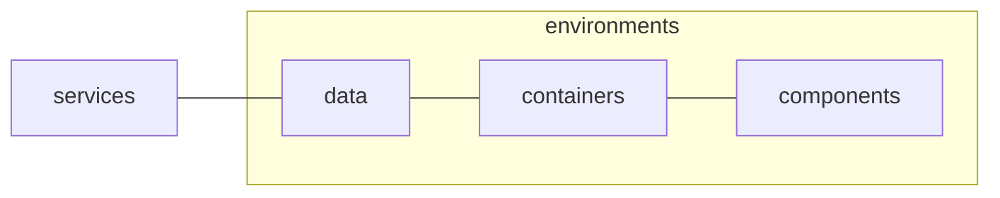
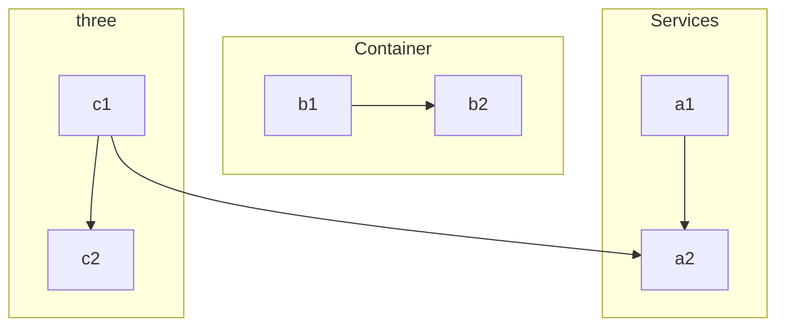

<!-- omit in toc -->
# 📺 Epic Stream App


<!-- omit in toc -->
## Table of Contents

- [🐦 Overview](#-overview)
- [🚀 Getting Started](#-getting-started)
  - [Production](#production)
  - [Local](#local)
  - [Data](#data)
  - [Testing](#testing)
    - [Storybook](#storybook)
    - [Automated Tests](#automated-tests)
    - [Linting](#linting)
- [Architecture](#architecture)
  - [Presentation](#presentation)
  - [Containers](#containers)
  - [Services](#services)
- [🏠 Architecture](#-architecture)
  - [Modules](#modules)
    - [Barrel Files](#barrel-files)
  - [Categories](#categories)
    - [Components](#components)
    - [Presentation](#presentation-1)
- [User Stories](#user-stories)


## 🐦 Overview

The goal of this repo is to provided a concrete example of how a modern software product subject to the forces and concerns of real-world usage might be composed. 

While it is relatively easy to build a basic throw-away to-do or basic app in React these often present a distorted view of what software development is like for juniors entering the industry:

- It is almost unthinkable that a junior or new member joining a team will be given the freedom to start a new project straight from `git init`.
- More often than not juniors spent the first parts of their career helping with debugging, documenting features and/or doing minor changes to existing code-bases like this.
- By definition, when a team has enough funding to hire juniors there is already a long history and a lot of legacy code that a junior has to work with.

While building small projects in isolation is helpful in terms of understanding the fundamentals and syntax of JavaScript and tools like React they leave out a large part of what day-to-day software development as a job actually entails.

The hope is that ths project provides a taste of how existing code and complexity in a project might look, that broader software principles like encapsulation, abstraction, automated testing and documentation can be understood without getting overwhelmed with the scale of the project.

For this reason some parts of the project can be considered over-engineered. However, as stated the goal is to introduce enough complexity to illustrate the values of the latter principles, without being overwhelming in terms of subject domain and scope of work.

Before starting it is also important that this is simply one way in which the complexity and concerns of the product can be approach, in modern software there is very little universal consensus in terms of the "correct" way to do software.

For this reason it is important that you proactively seek out areas where you disagree with the approach, and attempt to formulate why you disagree. The **primary skill** of software development is being able to talk about your reasoning process and discuss decisions made by others. It is inevitable that you will join a team when apply for a job that has very different preferences and ideas than you do (and even amongst one another). 

This means that the following are things dangers that will damage your career prospect more than any specific technologies you learn:

- The inability to talk about the decisions you made beyond "it just felt right" or "it is the only way I could get it to work". No code is "good" in a vacuum, it based on the reasoning behind it and what problems it attempts to solve.
- The ability to understand why alternative approach might be taken or preferred, as means to contribute to code that is not how you would personally have done it. Even if you are replacing this code with your own approach, you need to understand the underlying logic first.


## 🚀 Getting Started

### Production

No manual deployment processes are required, beyond pushing committed code directly to the `master` branch.

The app is automatically deployed to Vercel at [https://epic-stream.co.za](https://epic-stream-example.vercel.app/) based on updates to the `master` branch. 

Note that `npm test` runs as a Github action automatically 
before deployment. If the tests fail, then the new deployment is automatically aborted.

### Local

1. Ensure you have the [latest version of Git](https://git-scm.com/downloads) installed.
2. Clone the repo via `git clone https://github.com/schalkventer/epic-stream-app` from your terminal.
3. Ensure you have a at a minimum the [latest LTS version of Node](https://nodejs.org/en/) installed. 
4. Run `npm install` in the root of the project.
5. Run `npm start` after the latter to start a local server at `http://localhost:3000`. 

### Data

The core data consumed by the app is deployed to a separate URL at https://epic-stream-api.netlify.app. It exposes several JSON-based endpoints in a REST manner (only supporting GET currently). 

For more details on the API and how to use it please read the documentation at [https://github.com/schalkventer/epic-stream-api](https://github.com/schalkventer/epic-stream-api).

### Testing

This project broadly adheres to the principles of [Test-Driven Development (TDD)](https://en.wikipedia.org/wiki/Test-driven_development). This effectively means that all code is written in a manner that make it more easily testable, even if it requires additional complexity or abstractions within the code/architecture itself.

Note that this does not mean that all code needs to be tested, especially if it is trivial and/or likely to change often. However it does mean that testing is what "drives" development decisions. In other words, whether code is tested or not, the code should be written in a manner that makes it testable should you wish to do so.

#### Storybook

It recommended that all new components and containers are created and documented within [Storybook](https://storybook.js.org/) before being added to the itself app. This ensures that components can, first-and-foremost, be tested and debugged in isolation outside of the app itself. 

Please run `npm run test:storybook` in the project root to start the Storybook server at `http://localhost:6006`.

#### Automated Tests

Note that JSX files can only be tested by Storybook, all traditional `.js` files should be tested using automated tests. The two types of tests that can be used are as follows:

- [Unit tests](https://www.atlassian.com/continuous-delivery/software-testing/types-of-software-testing) should be used to test deterministic JavaScript helper functions.
- [Integration tests](https://www.atlassian.com/continuous-delivery/software-testing/types-of-software-testing) should be created for state-heavy React hooks.

Both of these should be created and maintained using the [Vitest testing-framework](https://vitest.dev/), and run by means of `npm test:vitest`.

#### Linting

Linting and formatting is enforced using [ESLint](https://eslint.org/) and [Prettier](https://prettier.io/). Most standard rules are included along with more opinionated rules from the [Airbnb JavaScript](https://airbnb.io/javascript/) and [Airbnb React](https://airbnb.io/react/) style guides.

Note that `linting` errors, while merely presented as warnings in local development, are treated as critical errors when running `npm test` in a CI/CD environment.

This means that you have a certain amount of flexibility when working locally. However, upon pushing the code to the `master` branch, you should ensure that no linting errors are present (otherwise the code will refuse to deploy).

For this reason it is recommended that you install the [ESLint extension](https://marketplace.visualstudio.com/items?itemName=dbaeumer.vscode-eslint) for Visual Studio Code to ensure that you are alerted to any linting errors as you code. If you are using a different code editor, you can find similar extension for most common editors/IDE's.

## Architecture

In accordance with the principles of [Separation of Concerns](https://en.wikipedia.org/wiki/Separation_of_concerns) the codebase is broadly split into three domains, each coinciding with one or more folders in the `/src` directory:

- Presentation: `src/components`
- Containers: `src/data`,and `src/containers`
- Services: `src/services` and `src/environments` 

While, not a traditional [Model-view-viewmodel (MVVM)](https://en.wikipedia.org/wiki/Model%E2%80%93view%E2%80%93viewmodel) architecture, it is broadly inspired by the MVVM approach. The key consideration is that the presentation components are not allowed to talk directly to external data sources. This decoupling means that various parts of the codebase can be debugged and testing in isolation. 

This relationship is primarily expressed by means of the folders located in the `src` directory as follows:

_Note that the first two folders ("presentation" and "containers") are based on a [Container/Presentational Pattern](https://javascriptpatterns.vercel.app/patterns/react-patterns/conpres)._

- `presentation`: React components that are exclusively responsible for rendering HTML based on a specific state. These are deterministic insofar that given the same props they should always behave in the same way.

- `containers`: These are React components that manage the relationship between the internal store data and the presentational components. Note that these are allowed to render HTML, however it is recommended that as far as possible as much rendering as possible be pushed to `presentation` components.

- `environments`: A very basic abstraction that allows is used to manage (Dependency Injection)[https://en.wikipedia.org/wiki/Dependency_injection]. Effectively there are only two mutually exclusive React components that can be used: `Testing` and `Production`. One of these should always be the top-most parent component wrapping all other components in the app. If the code is meant to be used by real users then the `Production` component should be used. Whereas, if the code is meant to be tested the `Testing` component should be used. This pattern means that services can be forced to behave in a certain way to test specific scenarios, and it decouples testing from production data - meaning that tests won't even change the actual data being shown to users accidentally.


Below is a visualization of this relationship




- 
- 
- 
- , these are very small abstractions that will always be the top-most component wrapping the entire app. They are responsible for exposing external services and behaviour to the codebase, depending on where the code is meant to run. For example, if you are testing code then you should use the `Testing` environment which mocks and stubs behaviour as needed, whereas if the code will be deployed to real-users you should use `Production`. This means that you force services to act in certain way 


 the 


"Services" (Model) layer does not directly talk to the "Presentation" (View) layer, but rather mediated by the "Container" (Viewmodel) layer. 

These layers coincide with the following folders in `src`:




- Presentation: 
  - `components`: Deterministic UI component, always renders/behaves the same when given the same props. Not allowed to directly connect to
- Containers: `data`and `containers`


- Presentation:
- 
- 
-  Responsible for rendering HTML, CSS and basic behaviour. 


- Services (Model)

- Containers (Viewmodel)

### Presentation

Most technologies used in the presentation layer are primarily concerned with converting data to HTML and CSS, and listening for user interactions.

- [React](https://reactjs.org/) components are the  primarily means by which the user-facing HTML, CSS and behaviour is rendered and managed.
- [Prop-Types](https://www.npmjs.com/package/prop-types) is used to document and enforce type-checking of all types that are passed to React components.
- [Material UI](https://mui.com/) provides a broad set of pre-built and well-tested React components that help save development time and effort.
- [Emotion](https://emotion.sh/docs/introduction) is as a general developer experience (DX) tool to help encapsulate CSS within React component and to more directly map specific CSS values to internal React state. However, Emotion was chosen above other alternatives that do the same due to it being used directly by Material UI as well.
- [React Spring](https://react-spring.io/) is used to provide a more "native app"-like, physics-based animation beyond the built-in, standard CSS transitions and animations.
- [Date Fns](https://date-fns.org/) provides a variety of helper functions, for various purposes. However in this codebase it is primarily used to format date values into user readable strings.

### Containers

Most technologies in the container layer are concerned with connecting the persistent data (exposed by "Services") with the user-facing React Components (exposed by "Presentation"). Most of the code in this layer can be found in React hooks or 

- [Zustand](https://zustand.surge.sh/) lies at the core of the viewmodel concern layer. It is used to manage all global data within the app in a more idiomatic and performant manner than the built-in React Context API.
- [Zod Dev](https://www.npmjs.com/package/zod-dev) is an extension that is used on top of [Zod](https://zod.dev/) to get the same type-safety in the Viewmodel as is provided when interfacing with the actual model, without the performance overhead.
- [Fuse.js](https://fusejs.io/) is used to provide fuzzy search behaviour when filtering and sorting data in the viewmodel. 
- 

### Services


    "@faker-js/faker": "^8.3.1",
    "date-fns": "^3.0.6",
    "fuse.js": "^7.0.0",
    "lodash": "^4.17.21",
    "prop-types": "^15.8.1",
    "query-string": "^8.1.0",
    "react": "^18.2.0",
    "react-router-dom": "^6.21.1",
    "react-use": "^17.4.2",
    "zod": "^3.22.4",
    "zod-dev": "^1.2.5",
    "zustand": "^4.4.7"


 where [React]

The following tools and libraries are used in this codebase:


The project is primarily built around [React](https://reactjs.org/), with all View-considerations being 

The initial project was structure was created using the React preset in [Vite](https://vitejs.dev/). 

- 
- [Vite](https://vitejs.dev/)

## 🏠 Architecture

The entire codebase is built using a general [module design pattern](https://en.wikipedia.org/wiki/Module_pattern). While JavaScript itself has built-in modules by means of ES Module imports and exports on a file-based level, the codebase generally aims to encapsulate meaningful units of code and behaviour into folder-level modules.

These modules are generally group under larger categories, that indicate what the modules are used for. See details below for further explaination of modules and categories.

### Modules

As an example we might have the `services` category folder, with modules `One`, `Two` and `three`

```
category/
├── One/
│   ├── index.js
│   ├── One.js
│   ├── One.Inner.js
│   ├── One.helpers.js
│   ├── One.schema.js
│   └── One.test.js
├── Two/
│   ├── index.js
│   ├── Two.js
│   └── Two.schema.js
└── three/
    ├── index.js
    ├── three.js
    ├── three.Inner.js
    ├── three.helpers.js
    ├── three.schema.js
    └── three.test.js
```

#### Barrel Files

You will note that all folders contain an `index.js` file. This is known as a [barrel file](https://flaming.codes/en/posts/barrel-files-in-javascript/). It should be the only thing that is ever imported directly from outside of the folder itself. This is the primary point of encapsulation of modules.

Also note that due to the way that the `Vite` 


The entire codebase is made up of [modules](https://en.wikipedia.org/wiki/Module_pattern) at the lowest level. These modules are controlled and encapsulated by means of using ES Module exports. 

The codebase is broad split into the following three categories, each with their own root folder in `/src`:

### Categories

- `components`
- `data`
- `services`

#### Components

The `src/components/` folder is the most straight-forward. It effectively contains all React components used in this product. Note that it contains all `.jsx` files used in the codebase. No `.jsx` files are allowed outside of the `components` folder. 

Also note that while it is possible to use JSX in regular `.js` files, it is recommended to clearly mark files that use JSX as `.jsx`. This makes it easier to determine which files are responsible for rendering HTML.

There `components` folder is further split into three more categories:

#### Presentation

These componenents located in `src/components/presentation`. These are components, that while they are allowed to have internal state are not allowed to connect to the Zustand stor or data services outside the props supplied to them.

This means that should be 100% deterministic based on the props passed to them. This means that given the same props they will always behave in the same way.


## User Stories

- [x] Project is deployed to a custom Netlify URL
- [x]  All views in the app display correct on the smallest mobile devices available “Iphone SE”. This can be emulated in Chrome Dev tools.

- [x]  All favicon information has been created an added correctly via [https://realfavicongenerator.net/](https://realfavicongenerator.net/) (you are welcome to use any free PNG image you find on [https://www.flaticon.com/](https://www.flaticon.com/))

- [x]  All metatag information has been creataed and added via [https://metatags.io/](https://metatags.io/) (You are welcome to use any free image you find on [https://unsplash.com/](https://unsplash.com/)). Be mindful to manually replace all URL values (especially image URL) to absolute Netlify URL values (you will need to deploy to Netlify first)

---

- [x]  All show data loaded via a `fetch` call from the `https://podcast-api.netlify.app/shows`
- [x]  All data is loaded a `fetch` and no endpoint-specific data is hardcoded
- [x] When viewing a specific show data is loaded via `fetch` from individual show endpoint
- [x]  There is a loading state while initial data is being loaded
- [x] There is a loading state while new data is being loaded

---

- [x]  User sees the name of all available shows on the platform
- [x] User sees shows broken down into seasons, sorted by number
- [ ] User has a way to listen to any episode in a season for a show
- [x] User is able to see a view where only episodes for a specific selected season is shown
- [x] User is able to toggle between different seasons for the same show

---

- [x] User sees preview image of shows when browsing
- [x] User sees the amount of season as number in a show when browsing
- [x] User sees a human-readable date to when a show was last updated
- [x] User sees what genres (as genre titles) a show is associated with when browsing

---

- [ ] User sees a preview image of seasons for specific show
- [x] User sees the amount of episodes as number for a season
- [x] User are able to go back to a show view from an season-specific view

---

- [ ] User is able to mark specific episodes as favourites so that they can find them again
- [ ] User can visit a view where they see all their favourites
- [ ] User is able to see the associated show and season when episode in favourite
- [ ] Related by season/show episodes are grouped together in favourites
- [ ] User is able able to remove episodes from their favourites

---

- [x] User is able to arrange list of shows based on title from A-Z
- [x] User is able to arrange list of shows based on title from Z-A
- [x] User is able to arrange list of showing the most recent updated
- [x] User is able to arrange list of shows from least recent updated
- [x] User is able to filter shows based on title by means of a text input
- [x] User is able to find shows based on fuzzy matching of concepts (you can use something like [https://fusejs.io/](https://fusejs.io/))

---

- [ ] User sees the date and time that I added something as a favourite
- [ ] User is able to arrange favourites based on title from A-Z
- [ ] User is able to arrange favourites based on title from Z-A
- [ ] User is able to arrange favourites starting with the most recent updated
- [ ] User is able to arrange favourites starting with the furthest back updated

---

- [ ] Audio player is always visible so that user can listen to episodes while I browse
- [ ] User receives a notification that confirms they want to close the page when audio is playing
- [ ] App remembers what shows and episode user listened to last when returning to the platform
- [x] Automatically filters shows by a genre if the genre label is clicked on
- [ ] App remembers and shows what episodes user listened all the way through
- [ ] App remembers the exact timestamp where user stoped listening within a 10 seconds accuracy of closing
- [ ] App remembers and shows the exact timestamp location of where I left off any episode
- [ ] User has the option to "reset" all there progress, effectively removing their listening history.

---

- [x] User is presented with a sliding carousel of possible shows they might be interested in on the landing page
- [ ] User is able to log in via [https://app.supabase.com](https://app.supabase.com/) authentication
- [ ] User favourites are stored in [https://app.supabase.com](https://app.supabase.com/) database
- [ ] User favourites are automatically synced when logged in, ensuring that they share favourites between devices
- [ ] Users are able to share their favourites as a publicly accessible URL
