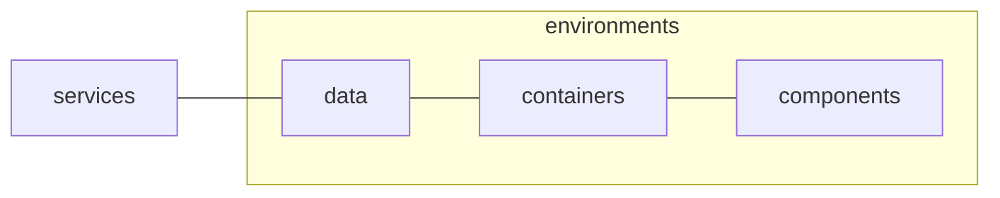

<!-- omit in toc -->
# 📺 Epic Stream App

<!-- omit in toc -->
## Table of Contents

- [🐦 Overview](#-overview)
- [🚀 Getting Started](#-getting-started)
  - [Production](#production)
  - [Local](#local)
  - [Data](#data)
  - [Testing](#testing)
    - [Storybook](#storybook)
    - [Automated Tests](#automated-tests)
    - [Linting](#linting)
- [Architecture](#architecture)

## 🐦 Overview

The goal of this repo is to provided a concrete example of how a modern software product subject to the forces and concerns of real-world usage might be composed. 

While it is relatively easy to build a basic throw-away to-do or basic app in React these often present a distorted view of what software development is like for juniors entering the industry:

- It is almost unthinkable that a junior or new member joining a team will be given the freedom to start a new project straight from `git init`.
- More often than not juniors spent the first parts of their career helping with debugging, documenting features and/or doing minor changes to existing code-bases like this.
- By definition, when a team has enough funding to hire juniors there is already a long history and a lot of legacy code that a junior has to work with.

While building small projects in isolation is helpful in terms of understanding the fundamentals and syntax of JavaScript and tools like React they leave out a large part of what day-to-day software development as a job actually entails.

The hope is that ths project provides a taste of how existing code and complexity in a project might look, that broader software principles like encapsulation, abstraction, automated testing and documentation can be understood without getting overwhelmed with the scale of the project.

For this reason some parts of the project can be considered over-engineered. However, as stated the goal is to introduce enough complexity to illustrate the values of the latter principles, without being overwhelming in terms of subject domain and scope of work.

Before starting it is also important that this is simply one way in which the complexity and concerns of the product can be approach, in modern software there is very little universal consensus in terms of the "correct" way to do software.

For this reason it is important that you proactively seek out areas where you disagree with the approach, and attempt to formulate why you disagree. The **primary skill** of software development is being able to talk about your reasoning process and discuss decisions made by others. It is inevitable that you will join a team when apply for a job that has very different preferences and ideas than you do (and even amongst one another). 

This means that the following are things dangers that will damage your career prospect more than any specific technologies you learn:

- The inability to talk about the decisions you made beyond "it just felt right" or "it is the only way I could get it to work". No code is "good" in a vacuum, it based on the reasoning behind it and what problems it attempts to solve.
- The ability to understand why alternative approach might be taken or preferred, as means to contribute to code that is not how you would personally have done it. Even if you are replacing this code with your own approach, you need to understand the underlying logic first.

## 🚀 Getting Started

### Production

No manual deployment processes are required, beyond pushing committed code directly to the `master` branch.

The app is automatically deployed to Vercel at [https://epic-stream.co.za](https://epic-stream-example.vercel.app/) based on updates to the `master` branch. 

Note that `npm test` runs as a Github action automatically 
before deployment. If the tests fail, then the new deployment is automatically aborted.

### Local

1. Ensure you have the [latest version of Git](https://git-scm.com/downloads) installed.
2. Clone the repo via `git clone https://github.com/schalkventer/epic-stream-app` from your terminal.
3. Ensure you have a at a minimum the [latest LTS version of Node](https://nodejs.org/en/) installed. 
4. Run `npm install` in the root of the project.
5. Run `npm start` after the latter to start a local server at `http://localhost:3000`. 

### Data

The core data consumed by the app is deployed to a separate URL at https://epic-stream-api.netlify.app. It exposes several JSON-based endpoints in a REST manner (only supporting GET currently). 

For more details on the API and how to use it please read the documentation at [https://github.com/schalkventer/epic-stream-api](https://github.com/schalkventer/epic-stream-api).

### Testing

This project broadly adheres to the principles of [Test-Driven Development (TDD)](https://en.wikipedia.org/wiki/Test-driven_development). This effectively means that all code is written in a manner that make it more easily testable, even if it requires additional complexity or abstractions within the code/architecture itself.

Note that this does not mean that all code needs to be tested, especially if it is trivial and/or likely to change often. However it does mean that testing is what "drives" development decisions. In other words, whether code is tested or not, the code should be written in a manner that makes it testable should you wish to do so.

#### Storybook

It recommended that all new components and containers are created and documented within [Storybook](https://storybook.js.org/) before being added to the itself app. This ensures that components can, first-and-foremost, be tested and debugged in isolation outside of the app itself. 

Please run `npm run test:storybook` in the project root to start the Storybook server at `http://localhost:6006`.

#### Automated Tests

Note that JSX files can only be tested by Storybook, all traditional `.js` files should be tested using automated tests. The two types of tests that can be used are as follows:

- [Unit tests](https://www.atlassian.com/continuous-delivery/software-testing/types-of-software-testing) should be used to test deterministic JavaScript helper functions.
- [Integration tests](https://www.atlassian.com/continuous-delivery/software-testing/types-of-software-testing) should be created for state-heavy React hooks.

Both of these should be created and maintained using the [Vitest testing-framework](https://vitest.dev/), and run by means of `npm test:vitest`.

#### Linting

Linting and formatting is enforced using [ESLint](https://eslint.org/) and [Prettier](https://prettier.io/). Most standard rules are included along with more opinionated rules from the [Airbnb JavaScript](https://airbnb.io/javascript/) and [Airbnb React](https://airbnb.io/react/) style guides.

Note that `linting` errors, while merely presented as warnings in local development, are treated as critical errors when running `npm test` in a CI/CD environment.

This means that you have a certain amount of flexibility when working locally. However, upon pushing the code to the `master` branch, you should ensure that no linting errors are present (otherwise the code will refuse to deploy).

For this reason it is recommended that you install the [ESLint extension](https://marketplace.visualstudio.com/items?itemName=dbaeumer.vscode-eslint) for Visual Studio Code to ensure that you are alerted to any linting errors as you code. If you are using a different code editor, you can find similar extension for most common editors/IDE's.

## Architecture

In accordance with the principles of [Separation of Concerns](https://en.wikipedia.org/wiki/Separation_of_concerns) the codebase is broadly split into three domains, each coinciding with one or more folders in the `/src` directory:

- Presentation: `src/components`
- Containers: `src/data`,and `src/containers`
- Services: `src/services` and `src/environments` 

While, not a traditional [Model-view-viewmodel (MVVM)](https://en.wikipedia.org/wiki/Model%E2%80%93view%E2%80%93viewmodel) architecture, it is broadly inspired by the MVVM approach. The key consideration is that the presentation components are not allowed to talk directly to external data sources. This decoupling means that various parts of the codebase can be debugged and testing in isolation. 

This relationship is primarily expressed by means of the folders located in the `src` directory as follows:

_Note that the first two folders ("presentation" and "containers") are based on a [Container/Presentational Pattern](https://javascriptpatterns.vercel.app/patterns/react-patterns/conpres)._

- `presentation`: React components that are exclusively responsible for rendering HTML based on a specific state. These are deterministic insofar that given the same props they should always behave in the same way.

- `containers`: These are React components that manage the relationship between the internal store data and the presentational components. Note that these are allowed to render HTML, however it is recommended that as far as possible as much rendering as possible be pushed to `presentation` components.

- `environments`: A very basic abstraction that allows is used to manage (Dependency Injection)[https://en.wikipedia.org/wiki/Dependency_injection]. Effectively there are only two mutually exclusive React components that can be used: `Testing` and `Production`. One of these should always be the top-most parent component wrapping all other components in the app. If the code is meant to be used by real users then the `Production` component should be used. Whereas, if the code is meant to be tested the `Testing` component should be used. This pattern means that services can be forced to behave in a certain way to test specific scenarios, and it decouples testing from production data - meaning that tests won't even change the actual data being shown to users accidentally.

Below is a visualization of this relationship

