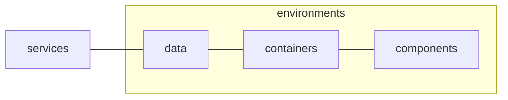

<!-- omit in toc -->
# 📺 Epic Stream App 

 

---


<!-- omit in toc -->
## Table of Contents

- [🎯 Goals](#-goals)
  - [Structure](#structure)
  - [Considerations](#considerations)
- [🚀 Getting Started](#-getting-started)
  - [Production](#production)
  - [Local](#local)
  - [Data](#data)
  - [Testing](#testing)
    - [Storybook](#storybook)
    - [Automated Tests](#automated-tests)
    - [Linting](#linting)
- [🏡 Architecture](#-architecture)
  - [Folders](#folders)
    - [Presentation](#presentation)
    - [Containers](#containers)
    - [Data](#data-1)
    - [Services](#services)
  - [Overview](#overview)
- [🍱 Modules](#-modules)
  - [Modules](#modules)
    - [Barrel Files](#barrel-files)
  - [Helper Files](#helper-files)
  - [Schema Files](#schema-files)
  - [Test Files](#test-files)
  - [Sub-module Files](#sub-module-files)
  - [🤖 Technologies](#-technologies)
  - [Presentation](#presentation-1)
  - [Containers](#containers-1)
- [User Stories](#user-stories)

## 🎯 Goals

This an example of a video streaming service built with React.

It aims to provide a concrete example of how a modern Single Page App (SPA) might be architected in response to the forces and concerns that act on real-world products.

The primarily goal is to illustrate the process of figuring out where code, files and folders are placed in a project, and how the following practices/processes guide these decisions:

- [Abstraction](https://en.wikipedia.org/wiki/Abstraction_(computer_science))
- [Separation of Concerns](https://en.wikipedia.org/wiki/Separation_of_concerns)
- [Encapsulation](https://en.wikipedia.org/wiki/Encapsulation_(computer_programming))
- [Polymorphism](https://en.wikipedia.org/wiki/Polymorphism_(computer_science))
- [Dependency Injection](https://en.wikipedia.org/wiki/Dependency_injection)
- [State Machines](https://en.wikipedia.org/wiki/Finite-state_machine)

It also assumes that any real-world project of meaningful complexity will strive to implement some degree of [Data Validation](https://en.wikipedia.org/wiki/Data_validation) and [Automated Testing](https://en.wikipedia.org/wiki/Test_automation). Therefore, the pursuit of validate and testing of data/code plays an important role in architectural decision made.

### Structure

The unfortunate reality is that there is no "one-size-fits-all" approach structuring code, files and folders. Architectural decisions are almost always made against specific business considerations or pre-existing technical constraints. In the words of Robert C. Martin:

> “Any organisation that designs a system will produce a design whose structure is a copy of the organisation's communication structure”
>
> - Clean Architecture (2017)

The critical implication is that every single team will have a unique project structure that is a reflection of the specific business, internal processes, technical and personal dynamics that exist within a team. Treating the question of where code, files and folders go as a pre-decided answer is more harmful to your career than helpful.

Instead of searching for a universal answer you should instead focus on growing your ability to understand, discuss and reason about the implications of these decisions. You will spend the vast majority of your career working on existing codebases, and very little (if at all) time creating brand new code from an entirely blank slate.

It is also from this perspective that this project is presented as an existing solution that can be reverse-engineered instead of a paint-by-numbers, step-by-step, guided tutorial.

### Considerations

To illustrate this principle, a common dynamic is introduced into this example:

The data exposed by means of the API does not map directly to what would make sense in terms of user experience. This is generally the first architectural decision you face when working on anything user-facing. To what degree will you adhere to the existing data model, versus to what degree will you re-model the data to better suit the user experience?

Depending on this answer, even using React itself might be a good fit or overkill. This means that decisions in terms of where code, files and folders go are already influenced before the first line of code is written.

In our case, we assume that the business has decided that they want to invest considerably resources into providing a seamless user experience when it comes to loading states, filtering, sorting. Furthermore, a decision was also made in the interest of scale and cost that instead of managing user accounts on a remote database that user-specific information will instead be persisted on the device itself.

Given the above considerations, a Single Page App (SPA) is a good fit for the project. While React is not the only (nor necessarily the best) tool to maintain a SPA, it has been decided on due to the immense popularity of React at the time. In terms of business considerations, this means that it will be easier hiring new developers and find third-party tooling that can be integrated into the codebase.

It is important to note that a lot of aspects of the project are over-engineered, while the scope of functionality is kept extremely limited. This is an intentional decision to aid in the goals of this project primarily serving as a teaching tool. This means that some of the initial concepts at the top of this document are deliberately exaggerated to illustrate them in a smaller, more tightly-scoped environment.

## 🚀 Getting Started

### Production

No manual deployment processes are required beyond committing code directly to the `master` branch.

The app is automatically deployed to Vercel at [https://epic-stream.co.za](https://epic-stream.co.za) based on updates to the `master` branch.

Note that `npm test` runs as a Github action automatically before deployment. If the tests fail, then the deployment of new code is automatically aborted.

### Local

1. Ensure you have the [latest version of Git](https://git-scm.com/downloads) installed.
2. Clone the repo via `git clone https://github.com/schalkventer/epic-stream-app` from your terminal.
3. Ensure you have at least the [latest LTS version of Node](https://nodejs.org/en/) installed.
4. Run `npm install` in the root of the project.
5. Run `npm start` after the latter to start a local server at `http://localhost:3000`.

### Data

The core data consumed by the app is deployed to a separate URL at https://epic-stream-api.netlify.app. It exposes several JSON-based endpoints in a RESTful manner (only supporting GET currently). For more details on the API and how to use it, please read the documentation at [https://github.com/schalkventer/epic-stream-api](https://github.com/schalkventer/epic-stream-api).

Note that as mentioned initial, the structure of the data exposed by the API is intentionally not directly mapped to what would make sense in terms of user experience. Not only is it considered bad practice to directly couple your data to user interface considerations, but this "problem" is also the motivation for using a React and creating an SPA in the first place. 

### Testing

This project broadly adheres to the principles of [Test-Driven Development (TDD)](https://en.wikipedia.org/wiki/Test-driven_development). This effectively means that all code is written in a manner that makes it more easily testable, even if it requires additional complexity or abstractions within the code/architecture itself.

Note that this [does not mean that all code needs to be tested](https://labs.ig.com/code-coverage-100-percent-tragedy), especially if it is trivial and/or likely to change often. However, it does mean that testing is what "drives" (i.e. "driven") development decisions. In other words, whether code is tested or not, the code should be written in a manner that makes it testable should you wish to do so.

#### Storybook

It is recommended that all new components and containers are created and documented within [Storybook](https://storybook.js.org/) before being added to the app itself. This ensures that components can, first and foremost, be tested and debugged in isolation outside of the app itself.

Please run `npm run test:storybook` in the project root to start the Storybook server at `http://localhost:6006`.

#### Automated Tests

Note that JSX files primarily be tested interactively in Storybook. However, all automated testing is done by means if [Vitest](https://vitest.dev/). These include the following types:

- Snapshot Tests: Presentation logic from Storybook can be tested for visual regressions by means of Vitest's snapshot testing.
- Unit Tests: Deterministic JavaScript helper functions can be tested directly with pre-defined input and output fixtures.
- Integration Tests: Should be used for state-heavy React hooks that directly interface with the global Zustand store.

All the above can be run by means of `npm test:vitest`.

#### Linting

Linting and formatting are enforced using [ESLint](https://eslint.org/) and [Prettier](https://prettier.io/). Most standard rules are included along with more opinionated rules from the [Airbnb JavaScript](https://airbnb.io/javascript/) and [Airbnb React](https://airbnb.io/react/) style guides.

Note that `linting` errors, while merely presented as warnings in local development, are treated as critical errors when running `npm test` in a CI/CD environment.

This means that you have a certain amount of flexibility when working locally. However, upon pushing the code to the `master` branch, you should ensure that no linting errors are present (otherwise, the code will refuse to deploy).

For this reason, it is recommended that you install the [ESLint extension](https://marketplace.visualstudio.com/items?itemName=dbaeumer.vscode-eslint) for Visual Studio Code to ensure that you are alerted to any linting errors as you code. If you are using a different code editor, you can find similar extensions for most common editors/IDEs.

## 🏡 Architecture

In accordance with the principles of [Separation of Concerns](https://en.wikipedia.org/wiki/Separation_of_concerns) the codebase is broadly split into four [abstraction layers](https://en.wikipedia.org/wiki/Abstraction_layer), each coinciding with a folder in the `/src` directory:

- Presentation: `src/components`
- Containers: `src/containers`
- Data: `src/data`
- Services: `src/services`

While, not a traditional [Model-view-viewmodel (MVVM)](https://en.wikipedia.org/wiki/Model%E2%80%93view%E2%80%93viewmodel) architecture, it is broadly inspired by the MVVM approach. The key consideration is that each abstraction layer are is only allowed to talk to its direct neighbor/s. This decoupling means that various parts of the codebase can be debugged and testing in isolation. 

This relationship is primarily expressed by means of the folders located in the `src` directory as follows:

_Note that the first two folders ("presentation" and "containers") are based on a [Container/Presentational Pattern](https://javascriptpatterns.vercel.app/patterns/react-patterns/conpres)._

### Folders

#### Presentation

React components that are exclusively responsible for rendering HTML based on a specific state internal state or provided props. These components should be deterministic insofar that given the same props they should always behave in the same way. Note that these components are not meant to be "dumb" or stateless, but instead are only allowed to access their internal state and props.

#### Containers

These are React components that manage the relationship between the global store and presentational components. Note that a lot of cases these presentational components can be built directly into the container itself, but in some cases they will pull re-usable presentational components from the `presentation` folder.

#### Data

The data folder is responsible for modelling the global data used within the app. Due to limited scope of this project all global app state is exclusively located in a single [Zustand](https://zustand.surge.sh/) store (`src/data/store.js`). This store is intentionally decoupled from the actual React hooks that act on it. The latter ensure that reactivity and re-rendering can more easily be controlled, and that a more robust tool such as [Redux Toolkit](https://redux-toolkit.js.org/) can be introduced easily should the complexity of the app grow significantly.

#### Services

A very basic abstraction over the React Context API that is used to manage [Dependency Injection](https://en.wikipedia.org/wiki/Dependency_injection). Effectively there are two mutually exclusive React components within `services`: `Testing` and `Production`. One of these should always be the top-most parent component wrapping all other components in the app. If the code is meant to be used by real users then the `Production` component should be used. Whereas, if the code is meant to be tested the `Testing` component should be used. This pattern means that services can be forced to behave in a certain way to test specific scenarios, and it decouples testing from production data - meaning that tests won't even change the actual data being shown to users accidentally. All other folders in `services` are in service of providing `Production` and `Testing` with their required data.


### Overview


Below is a visualization of this relationship, indicating the direct neighbors of each abstraction layer.



## 🍱 Modules

The entire codebase is built using a general [module design pattern](https://en.wikipedia.org/wiki/Module_pattern). While JavaScript itself has built-in modules by means of ES Module imports and exports on a file-based level, the codebase generally aims to encapsulate meaningful units of code and behaviour into folder-level modules.

These modules are generally group under larger categories, that indicate what the modules are used for. See details below for further explaination of modules and categories.

### Modules

As an example we might have the `services` category folder, with modules `One`, `Two` and `three`

```
category/
├── One/
│   ├── index.js
│   ├── One.js
│   ├── One.Inner.js
│   ├── One.helpers.js
│   ├── One.schema.js
│   └── One.test.js
├── Two/
│   ├── index.js
│   ├── Two.js
│   └── Two.schema.js
└── three/
    ├── index.js
    ├── three.js
    ├── three.Inner.js
    ├── three.helpers.js
    ├── three.schema.js
    └── three.test.js
```

#### Barrel Files

You will note that all folders contain an `index.js` file. This is known as a [barrel file](https://flaming.codes/en/posts/barrel-files-in-javascript/). It should be the only thing that is ever imported directly from outside of the folder itself. This is the primary point of encapsulation of modules.

### Helper Files

...

### Schema Files

...

### Test Files

...

### Sub-module Files

...

### 🤖 Technologies

### Presentation

Most technologies used in the presentation layer are primarily concerned with converting data to HTML and CSS, and listening for user interactions.

- [React](https://reactjs.org/) components are the  primarily means by which the user-facing HTML, CSS and behaviour is rendered and managed.
- [Prop-Types](https://www.npmjs.com/package/prop-types) is used to document and enforce type-checking of all types that are passed to React components.
- [Material UI](https://mui.com/) provides a broad set of pre-built and well-tested React components that help save development time and effort.
- [Emotion](https://emotion.sh/docs/introduction) is as a general developer experience (DX) tool to help encapsulate CSS within React component and to more directly map specific CSS values to internal React state. However, Emotion was chosen above other alternatives that do the same due to it being used directly by Material UI as well.
- [React Spring](https://react-spring.io/) is used to provide a more "native app"-like, physics-based animation beyond the built-in, standard CSS transitions and animations.
- [Date Fns](https://date-fns.org/) provides a variety of helper functions, for various purposes. However in this codebase it is primarily used to format date values into user readable strings.

### Containers

Most technologies in the container layer are concerned with connecting the persistent data (exposed by "Services") with the user-facing React Components (exposed by "Presentation"). Most of the code in this layer can be found in React hooks or 

- [Zustand](https://zustand.surge.sh/) lies at the core of the viewmodel concern layer. It is used to manage all global data within the app in a more idiomatic and performant manner than the built-in React Context API.
- [Zod Dev](https://www.npmjs.com/package/zod-dev) is an extension that is used on top of [Zod](https://zod.dev/) to get the same type-safety in the Viewmodel as is provided when interfacing with the actual model, without the performance overhead.
- [Fuse.js](https://fusejs.io/) is used to provide fuzzy search behaviour when filtering and sorting data in the viewmodel. 


## User Stories

- [x] Project is deployed to a custom Netlify URL
- [x]  All views in the app display correct on the smallest mobile devices available “Iphone SE”. This can be emulated in Chrome Dev tools.

- [x]  All favicon information has been created an added correctly via [https://realfavicongenerator.net/](https://realfavicongenerator.net/) (you are welcome to use any free PNG image you find on [https://www.flaticon.com/](https://www.flaticon.com/))

- [x]  All metatag information has been creataed and added via [https://metatags.io/](https://metatags.io/) (You are welcome to use any free image you find on [https://unsplash.com/](https://unsplash.com/)). Be mindful to manually replace all URL values (especially image URL) to absolute Netlify URL values (you will need to deploy to Netlify first)

---

- [x]  All show data loaded via a `fetch` call from the `https://podcast-api.netlify.app/shows`
- [x]  All data is loaded a `fetch` and no endpoint-specific data is hardcoded
- [x] When viewing a specific show data is loaded via `fetch` from individual show endpoint
- [x]  There is a loading state while initial data is being loaded
- [x] There is a loading state while new data is being loaded

---

- [x]  User sees the name of all available shows on the platform
- [x] User sees shows broken down into seasons, sorted by number
- [x] User has a way to listen to any episode in a season for a show
- [x] User is able to see a view where only episodes for a specific selected season is shown
- [x] User is able to toggle between different seasons for the same show

---

- [x] User sees preview image of shows when browsing
- [x] User sees the amount of season as number in a show when browsing
- [x] User sees a human-readable date to when a show was last updated
- [x] User sees what genres (as genre titles) a show is associated with when browsing

---

- ~User sees a preview image of seasons for specific show~
- [x] User sees the amount of episodes as number for a season
- [x] User are able to go back to a show view from an season-specific view

---

- [x] User is able to mark specific episodes as favourites so that they can find them again
- [ ] User can visit a view where they see all their favourites
- [ ] User is able to see the associated show and season when episode in favourite
- [ ] Related by season/show episodes are grouped together in favourites
- [x] User is able able to remove episodes from their favourites~

---

- [x] User is able to arrange list of shows based on title from A-Z
- [x] User is able to arrange list of shows based on title from Z-A
- [x] User is able to arrange list of showing the most recent updated
- [x] User is able to arrange list of shows from least recent updated
- [x] User is able to filter shows based on title by means of a text input
- [x] User is able to find shows based on fuzzy matching of concepts (you can use something like [https://fusejs.io/](https://fusejs.io/))

---

- [ ] User sees the date and time that I added something as a favourite
- [ ] User is able to arrange favourites based on title from A-Z
- [ ] User is able to arrange favourites based on title from Z-A
- [ ] User is able to arrange favourites starting with the most recent updated
- [ ] User is able to arrange favourites starting with the furthest back updated

---

- [x] Audio player is always visible so that user can listen to episodes while I browse
- [ ] User receives a notification that confirms they want to close the page when audio is playing
- [ ] App remembers what shows and episode user listened to last when returning to the platform
- [x] Automatically filters shows by a genre if the genre label is clicked on
- [ ] App remembers and shows what episodes user listened all the way through
- [ ] App remembers the exact timestamp where user stoped listening within a 10 seconds accuracy of closing
- [ ] App remembers and shows the exact timestamp location of where I left off any episode
- [ ] User has the option to "reset" all there progress, effectively removing their listening history.

---

- [x] User is presented with a sliding carousel of possible shows they might be interested in on the landing page
- [ ] User is able to log in via [https://app.supabase.com](https://app.supabase.com/) authentication
- [ ] User favourites are stored in [https://app.supabase.com](https://app.supabase.com/) database
- [ ] User favourites are automatically synced when logged in, ensuring that they share favourites between devices
- [ ] Users are able to share their favourites as a publicly accessible URL
